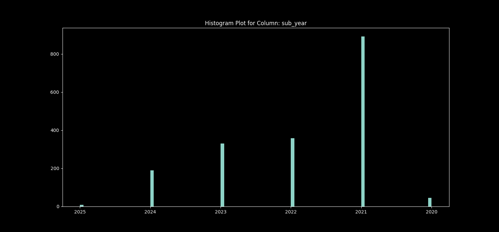
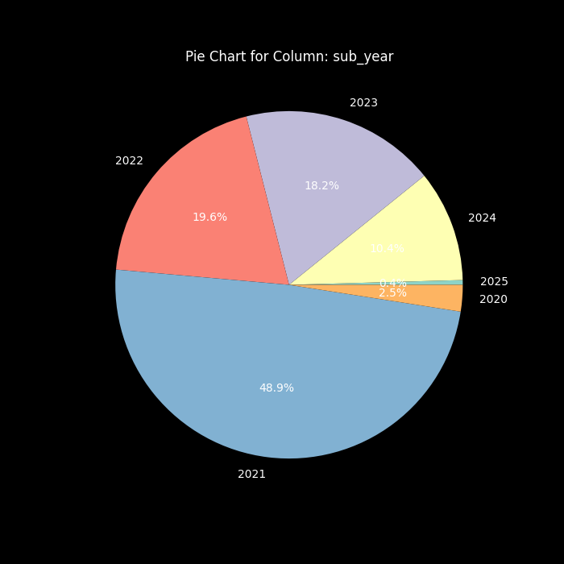
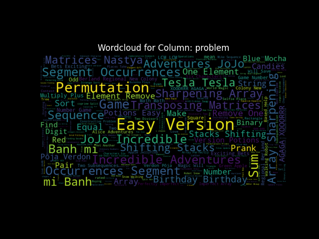
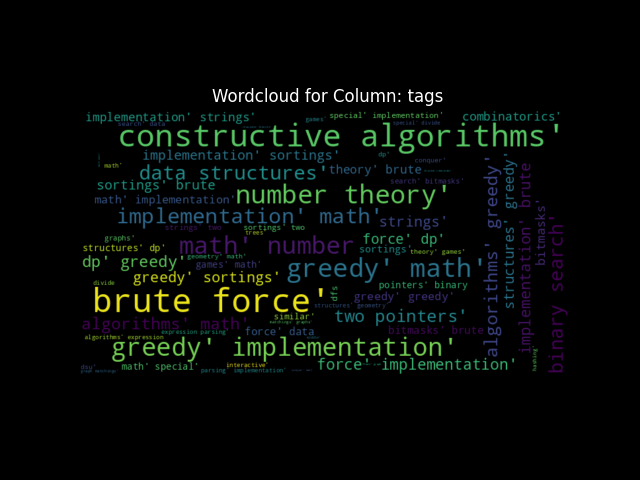

# Contest_Site_Scraper
 
## Install
Developed and tested on `Python 3.11.9`. Creata a new env to install the libs.
```
python3 -m venv /path/to/venv
pip3 install -r requirements.txt
```

## Usage

```
usage: python3 ContestSiteScraper.py [contest site name] [username] [opt. config file location (json)]
example: python3 ContestSiteScraper.py codeforces morariu.tudor
example: python3 ContestSiteScraper.py kilonva morariu_tudor
example: python3 ContestSiteScraper.py infoarena MorariuT /tmp/conf.json

avalible site names: codeforces, pbinfo, infoarena, kilonova
```

```
(venv) tudor@tudors-MacBook-Pro Cramschool_HW1 % python3 ContestSiteScraper.py codeforces morariu.tudor

  _                          __              __                     
 /   _  ._ _|_  _   _ _|_   (_  o _|_  _    (_   _ ._ _. ._   _  ._ 
 \_ (_) | | |_ (/_ _>  |_   __) |  |_ (/_   __) (_ | (_| |_) (/_ |  
                                                         |          
mkdir: ./plots: File exists
Getting morariu.tudor submissions from codeforces
Got 1823 entries
Plotting. Generating output in ./plots/morariu.tudor
Access this url for result: file:///Users/tudor/Documents/Work AI/Cramschool_HW1/plots/morariu.tudor/report_codeforces_morariu.tudor.html
```

## Extending the tool

The tool was made with modular individual site scrapers. 
A new site can be adeed by:
* Extend the GenericScraper class
* Implement the methods specific to the new site scraper
* Place your implementation in ./funcs
* Update the ./utils/config.json with the new site and scraper

## Plots

Avalible plots are:
* Histogram
* Column by column plot
* Wordclod
* Pie chart

## Pictures
  
  
  
  
